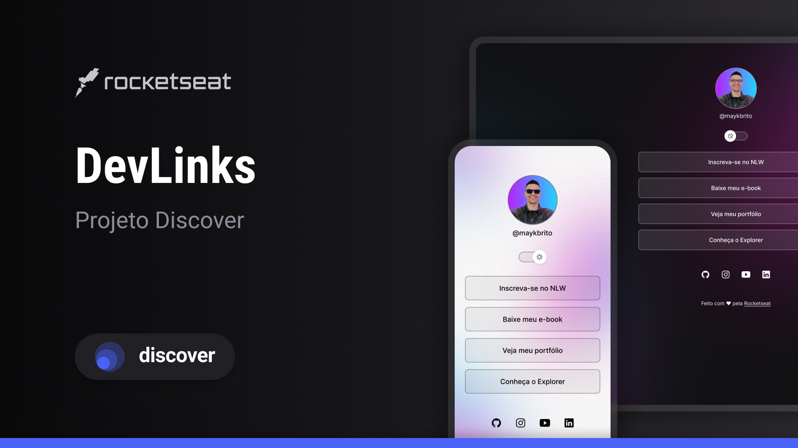

<h1 align="center">Dev Links 🔗</h1>

  

## 🚀 Tecnologias

Esse projeto foi desenvolvido com as seguintes tecnologias:

- HTML e CSS
- JavaScript
- Git e Github
- Figma

## 💻 Projeto

O DevLinks é um agregador de links para usar como cartão de visitas online.

## 📑 Layout

Você pode visualizar o layout do projeto através [DESSE LINK](https://www.figma.com/community/file/1187422022288947321/devlinks-projeto-discover). É necessário ter conta no [FIGMA](https://figma.com) para acessá-lo.

## 📝 Licença

Esse projeto está sob a licença MIT.